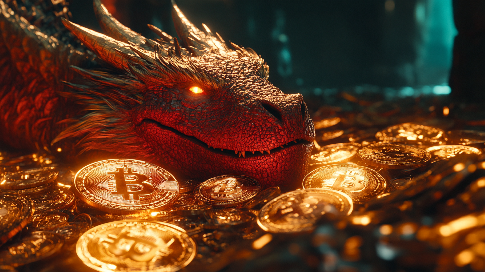

# Blockchain y activos digitales

{ width="800" }

La tecnología **blockchain** va mucho más allá de las criptomonedas, aunque estas sean su aplicación más conocida. Se trata de un sistema que permite registrar y verificar transacciones de forma descentralizada, creando un "libro de cuentas" digital que es inmutable y transparente. Es como una base de datos compartida y pública, por lo tanto, no puede ser modificada de manera fraudulenta sin que quede constancia. Esta tecnología está transformando sectores tan diversos como las finanzas, la logística y el arte digital.

En esta entrada exploraremos tres elementos fundamentales del ecosistema blockchain: la **tecnología blockchain** en sí misma, las **monedas digitales** (incluyendo las CBDC - Central Bank Digital Currencies) y los **NFTs** (Non-Fungible Tokens). Veremos sus aplicaciones reales, limitaciones y el impacto que están teniendo en diferentes industrias.

## Blockchain: Más allá de las criptomonedas

El **blockchain** es esencialmente una base de datos distribuida que mantiene un registro permanente y verificable de transacciones digitales. Cada "bloque" contiene información sobre transacciones y se enlaza con los bloques anteriores, formando una cadena inmutable.

### Aplicaciones empresariales del blockchain

1. **Trazabilidad en cadenas de suministro**: Walmart utiliza blockchain para rastrear el origen de sus productos frescos, permitiendo identificar la fuente de contaminación alimentaria en segundos en lugar de días[^1].

2. **Contratos inteligentes**: Empresas como Maersk e IBM desarollaron TradeLens. Aunque descontinuada hace poco, consistía en una plataforma que utilizaba contratos inteligentes para automatizar y agilizar procesos logísticos, reduciendo el papeleo y los tiempos de gestión en el transporte marítimo[^2].

3. **Autenticación y certificación**: La Universidad Politécnica de Cartagena utiliza blockchain para emitir títulos académicos digitales, garantizando su autenticidad y facilitando su verificación por parte de empleadores[^3].

### Limitaciones y desafíos

A pesar de su potencial, el blockchain enfrenta varios retos significativos:

- **Consumo energético**: Las redes blockchain tradicionales, especialmente Bitcoin, consumen enormes cantidades de energía. Ethereum, por ejemplo, redujo su consumo en un 99.9% al cambiar a Proof of Stake[^4].
- **Escalabilidad**: Las redes públicas tienen limitaciones en el número de transacciones por segundo que pueden procesar.
- **Complejidad técnica**: La implementación requiere expertise específico y puede ser costosa.

## Monedas digitales: CBDC y criptomonedas

Las monedas digitales están revolucionando el concepto de dinero, con dos vertientes principales: las **criptomonedas descentralizadas** y las **CBDC** (Central Bank Digital Currencies).

### CBDC: El futuro del dinero oficial

Las CBDC son versiones digitales de las monedas tradicionales, respaldadas por bancos centrales. El e-CNY (yuan digital) chino es el ejemplo más avanzado, con más de 260 millones de usuarios y transacciones que superan los 13.000 millones de dólares[^5].

#### Ventajas de las CBDC:
- **Inclusión financiera**: Facilitan el acceso a servicios financieros.
- **Reducción de costes**: Minimizan gastos de gestión del efectivo.
- **Control de política monetaria**: Permiten implementar políticas más precisas.

#### Preocupaciones:
- **Privacidad**: Riesgo de mayor control sobre las transacciones personales.
- **Ciberseguridad**: Necesidad de proteger el sistema contra ataques.
- **Impacto bancario**: Posible desintermediación del sistema bancario tradicional.

### Criptomonedas: Entre la innovación y la especulación

Las criptomonedas descentralizadas, como Bitcoin y Ethereum, han evolucionado desde experimentos tecnológicos hasta activos financieros globales. 

#### Casos de uso reales:
1. **Remesas internacionales**: El Salvador, tras adoptar Bitcoin como moneda de curso legal, ha visto una reducción significativa en los costes de remesas[^6].

2. **DeFi (Finanzas Descentralizadas)**: Plataformas como Aave permiten préstamos y depósitos sin intermediarios tradicionales, con más de $10 mil millones en activos bloqueados.

#### Riesgos y controversias:
- **Volatilidad extrema**: Fluctuaciones de precio impredecibles.
- **Impacto ambiental**: Especialmente en redes Proof of Work.
- **Uso ilícito**: Potencial para actividades ilegales.

## NFTs: Tokenización del mundo digital

Los **NFTs** (Non-Fungible Tokens) son certificados digitales únicos que representan la propiedad de activos digitales o físicos. 

### Aplicaciones innovadoras

1. **Industria del arte**: Christie's vendió la obra digital "Everydays: The First 5000 Days" por $69 millones, legitimando el arte digital[^7].

2. **Gamificación**: Axie Infinity creó una economía digital donde jugadores pueden ganar tokens con valor real, aunque su colapso posterior demuestra los riesgos de estos modelos[^8].

3. **Documentos legales**: La tokenización de títulos de propiedad y documentos oficiales está siendo explorada por varios gobiernos para reducir el fraude[^9].

### Problemas y críticas

- **Burbuja especulativa**: Muchos NFTs han perdido más del 90% de su valor.
- **Derechos de autor**: Casos frecuentes de plagio y robo de arte.
- **Sostenibilidad**: Cuestionamiento sobre el valor real a largo plazo.

## El futuro de los activos digitales

La tecnología blockchain y sus aplicaciones están madurando, pasando de la especulación a casos de uso prácticos. Las empresas están adoptando soluciones blockchain para problemas reales, mientras que los gobiernos exploran las CBDC como evolución del dinero fiduciario.

[^1]: [researchgate.net](https://www.researchgate.net/publication/352698139_Adoption_of_Blockchain_Technology_A_Case_Study_of_Walmart) - "How Walmart brought unprecedented transparency to the food supply chain with IBM Food Trust"

[^2]: [piernext.portdebarcelona.cat](https://piernext.portdebarcelona.cat/en/technology/tradelens-the-blockchain-platform-for-maritime-logistics/) - "TradeLens: Transforming container logistics through blockchain"

[^3]: [upct.es](https://www.upct.es/noticias/2020-01-21-tecnologia-blockchain-verificara-los-titulos-de-los-egresados-de-la-upct) - "La UPCT implementará blockchain en la emisión de títulos académicos"

[^4]: [ethereum.org](https://ethereum.org/en/energy-consumption/) - "Ethereum Energy Consumption"

[^5]: [techcrunch.com](https://techcrunch.com/2022/01/18/chinas-digital-yuan-wallet-now-has-260-million-individual-users/) - "China's digital yuan users exceed 260 million"

[^6]: [insights.som.yale.edu](https://insights.som.yale.edu/insights/el-salvador-adopted-bitcoin-as-an-official-currency-salvadorans-mostly-shrugged) - "Impact of Bitcoin adoption on remittances in El Salvador"

[^7]: [theverge.com](https://www.theverge.com/2021/3/11/22325054/beeple-christies-nft-sale-cost-everydays-69-million) - "Beeple's NFT artwork sells for $69 million"

[^8]: [bloomberg.com](https://www.bloomberg.com/news/features/2022-06-10/axie-infinity-axs-crypto-game-promised-nft-riches-gave-ruin) - "The Rise and Fall of Axie Infinity"

[^9]: [abounaja.com](https://abounaja.com/blog/blockchain-technology-and-intellectual-property) - "How blockchain could transform property rights"