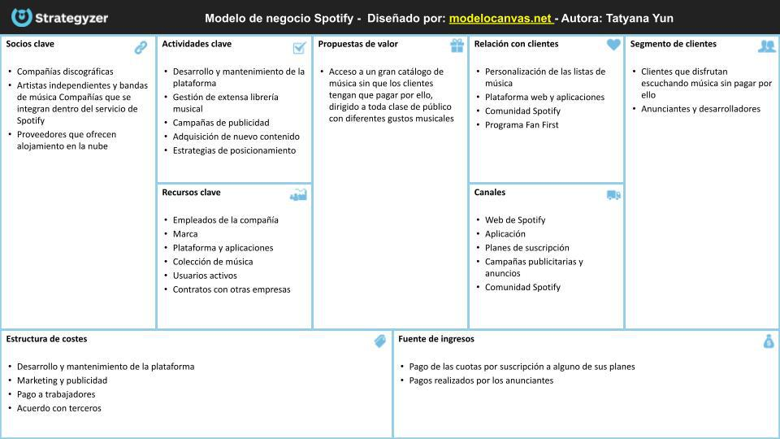

# Modelo Canvas

{ width="800" }

## Definición

El **Modelo Canvas** o **Business Model Canvas (BMC)** es una herramienta de gestión estratégica que permite diseñar, visualizar y analizar modelos de negocio de manera simplificada y estructurada[^1]. Desarrollado por Alexander Osterwalder e Yves Pigneur en 2010, el Canvas ofrece un marco visual que permite representar en un solo lienzo todos los aspectos fundamentales de un negocio, facilitando la comprensión, comunicación y optimización de la propuesta de valor de una empresa[^2]. A diferencia de los planes de negocio tradicionales, el Canvas sintetiza la estrategia empresarial en un formato gráfico e intuitivo, permitiendo identificar rápidamente las interrelaciones entre los diferentes componentes del modelo.

## Estructura y componentes

El Modelo Canvas se estructura en nueve bloques fundamentales que representan las áreas clave de cualquier negocio[^3]. Estos bloques están organizados de forma lógica e interconectada, reflejando cómo una empresa crea, entrega y captura valor:

| **Componente** | **Descripción** |
|----------------|-----------------|
| **Segmentos de clientes** | Grupos de personas u organizaciones a los que la empresa dirige sus productos o servicios |
| **Propuesta de valor** | Conjunto de productos y servicios que resuelven problemas o satisfacen necesidades de los clientes de forma diferencial |
| **Canales** | Medios a través de los cuales la empresa se comunica con sus clientes y les entrega su propuesta de valor |
| **Relaciones con clientes** | Tipos de relaciones que la empresa establece con cada segmento de clientes |
| **Fuentes de ingresos** | Formas en que la empresa genera ingresos a partir de cada segmento de clientes |
| **Recursos clave** | Activos más importantes requeridos para que el modelo de negocio funcione |
| **Actividades clave** | Acciones más importantes que la empresa debe realizar para que su modelo de negocio funcione |
| **Socios clave** | Red de proveedores y aliados estratégicos que contribuyen al funcionamiento del modelo de negocio |
| **Estructura de costes** | Todos los costes incurridos para operar el modelo de negocio |

## Explicación

El Modelo Canvas funciona como un mapa visual que representa la lógica de cómo una organización crea, entrega y captura valor. Para entenderlo mejor, podemos dividir el lienzo en dos grandes áreas:

- El lado derecho se centra en el valor y el cliente (segmentos de clientes, propuesta de valor, canales, relaciones con clientes y fuentes de ingresos).
- El lado izquierdo se enfoca en la infraestructura y aspectos operativos (recursos clave, actividades clave, socios clave y estructura de costes).

Imaginemos una cafetería que quiere revisar su modelo de negocio utilizando el Canvas:

1. **Segmentos de clientes**: Identificaría sus diferentes tipos de clientes, como estudiantes, profesionales locales y turistas.

2. **Propuesta de valor**: Definiría qué ofrece que sea diferencial, como café de especialidad, ambiente acogedor para trabajar y productos orgánicos.

3. **Canales**: Establecería cómo llega a sus clientes, mediante el local físico, redes sociales o servicios de entrega a domicilio.

4. **Relaciones con clientes**: Determinaría qué tipo de relaciones mantiene, como atención personalizada, programa de fidelización o comunidad en redes sociales.

5. **Fuentes de ingresos**: Identificaría de dónde provienen sus ingresos: venta directa de productos, suscripciones mensuales o alquiler de espacios para eventos.

6. **Recursos clave**: Listaría los activos imprescindibles, como el local, máquinas de café, personal cualificado y recetas propias.

7. **Actividades clave**: Definiría las acciones fundamentales, como la preparación de bebidas, aprovisionamiento de materia prima y creación de ambiente acogedor.

8. **Socios clave**: Identificaría sus aliados estratégicos, como proveedores de café, productores locales y empresas cercanas para servicios corporativos.

9. **Estructura de costes**: Detallaría sus principales gastos, como alquiler, personal, materias primas y marketing.

Al visualizar todos estos elementos en conjunto, la cafetería podría identificar inconsistencias, oportunidades de mejora o nuevas formas de diferenciarse de la competencia.

## Beneficios del modelo Canvas

La implementación del Modelo Canvas ofrece numerosas ventajas para las organizaciones[^4]:

1. **Visión estratégica integral**: Proporciona una perspectiva holística del negocio, mostrando cómo interactúan los diferentes elementos para crear valor.

2. **Simplicidad y claridad**: Reduce conceptos empresariales complejos a un formato visual intuitivo, facilitando la comprensión por parte de todos los integrantes de la organización.

3. **Fomento de la innovación**: Permite identificar nuevas oportunidades, segmentos de clientes no atendidos o fuentes de ingresos adicionales.

4. **Flexibilidad y adaptabilidad**: Es aplicable a cualquier tipo de negocio o industria, y puede ajustarse fácilmente ante cambios en el entorno.

5. **Mejora en la toma de decisiones**: Facilita la evaluación del impacto potencial de diferentes opciones estratégicas sobre cada componente del modelo.

6. **Colaboración y alineamiento**: Promueve el trabajo en equipo y ayuda a alinear a todos los departamentos en torno a una visión común del negocio.

## Caso práctico: Spotify y el modelo Canvas

Spotify representa un ejemplo destacado de aplicación efectiva del Modelo Canvas en el sector de la música digital[^5]. A continuación, se analiza cómo la plataforma de streaming ha estructurado su modelo de negocio:

{ width="800" }

Este caso muestra cómo Spotify ha utilizado el Canvas para crear un modelo de negocio disruptivo que ha transformado la industria musical, pasando de la venta de álbumes físicos a un modelo de acceso por suscripción. La empresa ha sabido equilibrar la creación de valor para múltiples segmentos (oyentes y artistas) mientras gestiona eficientemente sus costes más significativos (pagos por derechos musicales).

## Implementación efectiva

Para aplicar el Modelo Canvas de manera efectiva en una organización, se recomienda seguir estos pasos[^6]:

1. **Formar un equipo multidisciplinar** que aporte diferentes perspectivas sobre el negocio.

2. **Comenzar por la propuesta de valor y los segmentos de clientes**, ya que constituyen el núcleo del modelo.

3. **Desarrollar los demás componentes** de manera interconectada, asegurando coherencia entre todos los bloques.

4. **Utilizar notas adhesivas o herramientas digitales** para facilitar la colaboración y permitir ajustes durante el proceso.

5. **Revisar críticamente el primer borrador**, identificando inconsistencias o áreas de mejora.

6. **Validar las hipótesis** con clientes potenciales, datos de mercado o expertos del sector.

7. **Iterar y refinar** el modelo basándose en el feedback obtenido.

8. **Traducir el Canvas en planes de acción** concretos para cada área de la empresa.

9. **Establecer métricas** para evaluar el desempeño del modelo implementado.

10. **Revisar periódicamente** el Canvas para adaptarlo a cambios en el entorno o en la propia organización.

La implementación no debe verse como un ejercicio puntual, sino como un proceso continuo de aprendizaje y adaptación que permite a la empresa evolucionar en un entorno competitivo cambiante.

## Variantes y adaptaciones

Aunque el Modelo Canvas original es ampliamente aplicable, han surgido diversas adaptaciones para contextos específicos:

- **Lean Canvas**: Desarrollado por Ash Maurya, está especialmente diseñado para startups, con mayor énfasis en problemas, soluciones y métricas clave.

- **Social Business Model Canvas**: Adaptado para empresas sociales, incorpora elementos como impacto social y beneficiarios.

- **Service Business Model Canvas**: Enfocado en empresas de servicios, con énfasis en la experiencia del cliente y los puntos de contacto.

Estas variantes mantienen la esencia metodológica del Canvas original pero ajustan determinados componentes para reflejar mejor las prioridades y dinámicas propias de sectores específicos.

[^1]: Asana. (s.f.). Business Model Canvas: qué es y cómo utilizarlo. https://asana.com/es/resources/business-model-canvas

[^2]: Instituto Cajasol. (s.f.). Qué es el modelo Canvas. https://institutocajasol.com/que-es-el-modelo-canvas/

[^3]: MITECO. (s.f.). Metodología Canvas. https://www.miteco.gob.es/content/dam/miteco/es/ceneam/grupos-de-trabajo-y-seminarios/centros-de-documentacion-ambiental-y-espacios-naturales-protegidos/02-pino-metodologia-canvas_tcm30-488249.pdf

[^4]: CoVince. (s.f.). 5 Benefits of Adopting Business Model Canvas in Your Company. https://covince.com/insights/CoVince/es/5BenefitsofAdoptingBusinessModelCanvasinYourCompany/afc37a5f-8f26-4874-a2b9-8e0dac287828

[^5]: RD Station. (s.f.). Ejemplos de modelo Canvas. https://www.rdstation.com/blog/es/ejemplos-de-modelo-canvas/

[^6]: Escala. (s.f.). Modelo Canvas: formato, beneficios y ejemplos. https://escala.com/modelo-canvas-formato-beneficios-ejemplos/