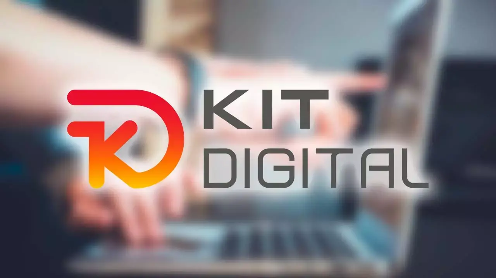

# Kit Digital

{ width="800" }

## Definición

El **Kit Digital**[^1] es un programa de ayudas impulsado por el Gobierno de España, gestionado por Red.es, que tiene como objetivo promover la digitalización de pequeñas empresas, microempresas y autónomos en todo el territorio español. Este programa forma parte del Plan de Recuperación, Transformación y Resiliencia de la economía española, financiado por los fondos Next Generation EU, y se articula mediante un sistema de bonos digitales que facilitan la adopción de soluciones tecnológicas para mejorar la competitividad y el nivel de madurez digital del tejido empresarial español.

## Estructura y funcionamiento

### Segmentación de beneficiarios

El Kit Digital está diseñado para atender a diferentes segmentos empresariales según su tamaño, estableciendo distintas cuantías de ayuda para cada categoría[^2]:

| **Segmento** | **Tamaño de empresa** | **Cuantía máxima del bono** |
|--------------|------------------------|------------------------------|
| Segmento I   | 10-49 empleados       | Hasta 12.000€                |
| Segmento II  | 3-9 empleados         | Hasta 6.000€                 |
| Segmento III | 0-2 empleados         | Hasta 3.000€                 |
| Segmento IV  | 50-99 empleados       | Hasta 25.000€                |
| Segmento V   | 100-249 empleados     | Hasta 29.000€                |

### Catálogo de soluciones digitales

El programa ofrece acceso a un catálogo específico de soluciones digitales[^3] que incluye:

- **Presencia en internet**: Creación de sitios web y servicios para mejorar la posición online.
- **Comercio electrónico**: Implementación de tiendas online y sistemas de gestión de ventas.
- **Gestión de redes sociales**: Herramientas para la gestión y publicación de contenidos en plataformas sociales.
- **Gestión de clientes (CRM)**: Sistemas para optimizar la relación con clientes actuales y potenciales.
- **Business Intelligence y Analítica**: Herramientas para el análisis de datos empresariales.
- **Servicios y herramientas de oficina virtual**: Soluciones para facilitar el teletrabajo y la colaboración.
- **Gestión de procesos**: Automatización y digitalización de flujos de trabajo.
- **Factura electrónica**: Sistemas para la emisión, recepción y gestión de facturas electrónicas.
- **Comunicaciones seguras**: Herramientas para garantizar comunicaciones cifradas y seguras.
- **Ciberseguridad**: Soluciones para proteger dispositivos y sistemas de información.
- **Inteligencia Artificial**: Incorporada recientemente, enfocada en mejorar procesos empresariales mediante algoritmos avanzados.

### Proceso de solicitud

El procedimiento para acceder a las ayudas del Kit Digital sigue los siguientes pasos[^4]:

1. **Registro y autodiagnóstico**: El interesado debe registrarse en la plataforma Acelera Pyme y realizar un test de autodiagnóstico para evaluar su nivel de madurez digital.
2. **Consulta del catálogo**: Revisar las soluciones disponibles y seleccionar las más adecuadas para la empresa.
3. **Solicitud formal**: Presentar la solicitud a través de la sede electrónica de Red.es.
4. **Concesión del bono**: Una vez aprobada la solicitud, la empresa recibe el bono digital virtual.
5. **Contratación de servicios**: El beneficiario selecciona uno o varios agentes digitalizadores del catálogo oficial y contrata los servicios elegidos.

Es importante destacar que los beneficiarios no reciben directamente el dinero, sino que este se utiliza para pagar a los agentes digitalizadores una vez implementadas satisfactoriamente las soluciones contratadas.

## Explicación

El Kit Digital puede entenderse como un "cheque tecnológico" que el Gobierno español pone a disposición de las empresas para impulsar su modernización digital. Funciona de manera similar a un "vale de compra" con un importe determinado que solo puede gastarse en un catálogo específico de productos y servicios digitales.

Para ilustrarlo con un ejemplo práctico, imaginemos una pequeña tienda de ropa con 5 empleados que quiere expandir su negocio online:

1. La tienda pertenecería al Segmento II, por lo que podría acceder a un bono de hasta 6.000€.
2. Tras realizar el autodiagnóstico digital, identifica que necesita mejorar su presencia online y capacidad de venta por internet.
3. Decide utilizar 2.500€ del bono para desarrollar una página web profesional con tienda online, y 2.000€ adicionales para implementar un sistema CRM que le permita gestionar mejor la relación con sus clientes.
4. Selecciona un agente digitalizador acreditado que ofrece ambos servicios y formaliza la contratación.
5. El agente implementa las soluciones acordadas y, una vez verificada su correcta puesta en marcha, recibe el pago directamente del programa Kit Digital.

De esta forma, la tienda logra digitalizar aspectos fundamentales de su negocio sin tener que realizar una inversión directa, mejorando así su competitividad en el mercado.

## Impacto y resultados

El Kit Digital se ha convertido en una de las iniciativas de digitalización empresarial más relevantes en España, con resultados significativos[^5]:

- Más de 310.000 ayudas concedidas, equivalentes a aproximadamente 1.400 millones de euros.
- Más de 350.000 proyectos de transformación digital puestos en marcha.
- Presencia en el 80% de los municipios españoles.
- Más de 300 jornadas informativas, seminarios y webinars realizados para difundir el programa.

Este alcance demuestra el interés de las pymes y autónomos españoles por modernizar sus negocios a través de la digitalización, así como la eficacia del modelo de implementación elegido.

## Retos y consideraciones críticas

A pesar de sus beneficios evidentes, el Kit Digital también presenta algunos desafíos que deben ser considerados[^6]:

1. **Barreras para pequeños proveedores**: Los requisitos económicos para convertirse en agente digitalizador (facturación mínima de 100.000€ anuales) excluyen a muchos profesionales independientes y microempresas especializadas que podrían ofrecer servicios personalizados.

2. **Sostenibilidad de las soluciones**: Existe una tendencia entre las empresas beneficiarias a adoptar tecnologías avanzadas sin considerar adecuadamente los requisitos de mantenimiento y actualización posteriores, lo que puede comprometer la efectividad a largo plazo de estas inversiones.

3. **Calidad y personalización**: Algunos beneficiarios reportan haber recibido servicios estandarizados que no se adaptan adecuadamente a las particularidades de su modelo de negocio, especialmente en el desarrollo de páginas web.

4. **Carga burocrática**: El proceso de solicitud y justificación de las ayudas implica una considerable carga administrativa que puede resultar desalentadora para algunas pequeñas empresas.

Para maximizar el impacto del programa, sería recomendable revisar estos aspectos en futuras ediciones, estableciendo mecanismos que evalúen la capacidad técnica de los proveedores más allá de umbrales económicos, y complementando las ayudas a la implementación con programas de acompañamiento que aseguren la correcta utilización y mantenimiento de las soluciones adoptadas.

[^1]: Red.es. (s.f.). Kit Digital. https://www.red.es/es/iniciativas/proyectos/kit-digital

[^2]: El País. (2024). Claves del Kit Digital para 2025: servicios, novedades y cómo solicitarlo. https://elpais.com/economia/branded/en-plan-pyme/2024-12-17/claves-del-kit-digital-para-2025-servicios-novedades-y-como-solicitarlo.html

[^3]: Acelera Pyme. (s.f.). Soluciones Digitales. https://www.acelerapyme.gob.es/kit-digital/soluciones-digitales

[^4]: Impulsa Empresa. (s.f.). Guía Kit Digital. https://www.impulsa-empresa.es/guia-kit-digital/

[^5]: Plan de Recuperación. (s.f.). Balance del programa Kit Digital para la digitalización de pymes y autónomos españoles. https://planderecuperacion.gob.es/noticias/conoce-balance-programa-Kit-Digital-digitalizacion-pymes-autonomos-espanoles-prtr

[^6]: Soulvi. (s.f.). El lado oculto del Kit Digital: lo que nadie te cuenta. https://soulvi.com/blog-entradas/consejos-de-negocios/el-lado-oculto-del-kit-digital-lo-que-nadie-te-cuenta/