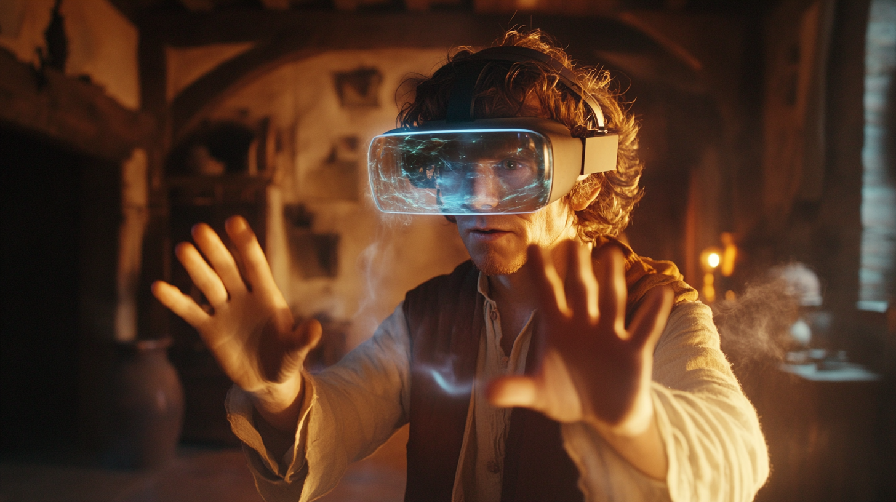

# Realidad Virtual y Realidad Aumentada

{ width="800" }

La **Realidad Virtual (VR)** y la **Realidad Aumentada (AR)** están transformando la forma en que interactuamos con la información digital. Mientras que la VR nos sumerge en mundos completamente digitales, la AR superpone elementos virtuales sobre nuestro entorno real. Estas tecnologías están evolucionando rápidamente, creando nuevas oportunidades en educación, industria, entretenimiento y medicina.

## Realidad Virtual: Inmersión total

La Realidad Virtual crea un entorno tridimensional completamente digital en el que el usuario puede sumergirse e interactuar. Mediante dispositivos como visores VR y controladores de movimiento, las personas pueden experimentar y manipular estos espacios virtuales como si fueran reales.

### Aplicaciones principales

1. **Formación y entrenamiento**: 
   - Boeing utiliza VR para entrenar a sus técnicos en mantenimiento de aeronaves, reduciendo el tiempo de formación en un 75%.
   - Los cirujanos practican procedimientos complejos en entornos virtuales antes de operar a pacientes reales, mejorando la precisión y reduciendo riesgos.

2. **Diseño y prototipado**:
   - Volkswagen implementa VR en su proceso de diseño, permitiendo a los ingenieros evaluar prototipos virtuales antes de la fabricación física.
   - Los arquitectos utilizan VR para que los clientes experimenten los espacios antes de su construcción.

3. **Entretenimiento y gaming**:
   - Meta (anteriormente Facebook) ha invertido más de $10 mil millones en desarrollo VR, con Quest como líder en el mercado de visores.
   - El mercado de juegos VR alcanzó los $22.9 mil millones en 2022.

### Limitaciones actuales

- **Mareo por movimiento**: Algunos usuarios experimentan náuseas durante sesiones prolongadas.
- **Coste de equipamiento**: Los dispositivos de alta calidad siguen siendo relativamente caros.
- **Requisitos de espacio**: Necesidad de áreas dedicadas para experiencias inmersivas.
- **Fatiga visual**: El uso prolongado puede causar tensión ocular.

## Realidad Aumentada: Fusionando lo real y lo virtual

La Realidad Aumentada enriquece el mundo físico con elementos digitales, desde información contextual hasta modelos 3D interactivos. A diferencia de la VR, la AR permite a los usuarios mantener la conciencia de su entorno mientras interactúan con contenido digital.

### Casos de uso empresariales

1. **Manufactura y mantenimiento**:
   - BMW utiliza gafas AR para guiar a sus técnicos en reparaciones complejas, reduciendo los errores en un 25%.
   - Airbus ha implementado AR en su línea de montaje, proyectando instrucciones directamente sobre las piezas.

2. **Retail y comercio**:
   - IKEA Place permite a los clientes visualizar muebles en sus espacios reales antes de comprarlos.
   - Sephora utiliza AR para que los clientes prueben maquillaje virtualmente.

3. **Educación y formación**:
   - Las escuelas de medicina utilizan AR para estudiar anatomía con modelos 3D interactivos.
   - Los museos implementan AR para hacer sus exhibiciones más interactivas y educativas.

### Retos actuales

- **Precisión de seguimiento**: Necesidad de mejor registro espacial.
- **Autonomía de dispositivos**: Limitaciones de batería en dispositivos móviles.
- **Condiciones ambientales**: El rendimiento puede verse afectado por la iluminación.
- **Privacidad**: Preocupaciones sobre la captura constante de datos del entorno.

## Realidad Mixta: Lo mejor de ambos mundos

La **Realidad Mixta (MR)** combina elementos de VR y AR, permitiendo que objetos virtuales interactúen con el entorno real de manera más sofisticada. Microsoft HoloLens ha sido pionera en este campo, especialmente en aplicaciones industriales.

### Aplicaciones innovadoras

1. **Industria 4.0**:
   - Thyssenkrupp utiliza HoloLens para mantenimiento de ascensores, reduciendo el tiempo de servicio en cuatro veces.
   - Volvo implementa MR en su proceso de diseño y control de calidad.

2. **Medicina**:
   - Cirujanos utilizan MR para visualizar datos del paciente durante operaciones.
   - La planificación quirúrgica mejora con modelos 3D interactivos.

## El futuro de las realidades extendidas

El metaverso representa la próxima evolución de estas tecnologías, prometiendo espacios virtuales persistentes donde VR, AR y MR convergen. Sin embargo, los expertos señalan varios desafíos:

1. **Técnicos**:
   - Necesidad de mayor ancho de banda y menor latencia.
   - Mejora en la duración de las baterías.
   - Desarrollo de interfaces más naturales.

2. **Sociales**:
   - Preocupaciones sobre adicción y aislamiento.
   - Protección de datos personales.
   - Accesibilidad y brecha digital.