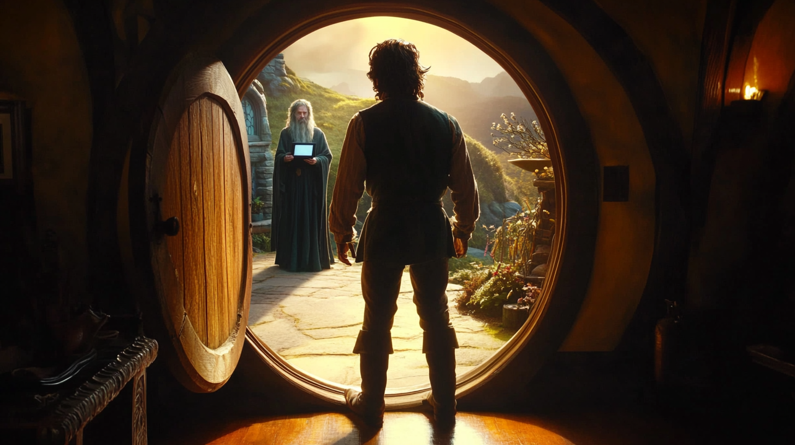

# Portada

## Unidad 1: Una digitalización inesperada

{ width="800" }

### Tabla de contenidos

* [Digitalización y Transformación Digital](digitalizacion.md)
* [IT/OT](it-ot.md)
* [Departamentos IT y roles](departamentos-it.md)
* [Inteligencia Artificial](ia.md)
* [Machine Learning y Deep Learning](ml-dl.md)
* [Inteligencia Artificial Generativa](iag.md)
* [Grandes Modelos de Lenguaje (LLM)](llm.md)
* [Retrieval Augmented Generation (RAG)](rag.md)
* [Agentes](agentes.md)
* [Sistemas complejos](sistemas-complejos.md)