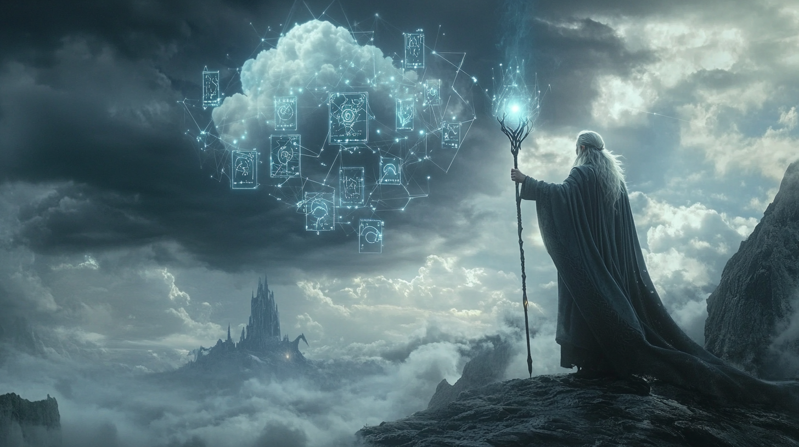

# Portada

## Unidad 3: La batalla de las infinitas nubes

{ width="800" }

### Tabla de contenidos

* [Kit digital](kit.md)

* [Modelo Canvas](canvas.md)

* [Metodología OKR](okr.md)

* [Metodologías ágiles](agiles.md)

* [Matriz de riesgos y Matriz RACI](matrices.md)

* [Paradigmas de computación distribuida](cloud.md)

* [Tipos de servicios en la nube](servicios.md)