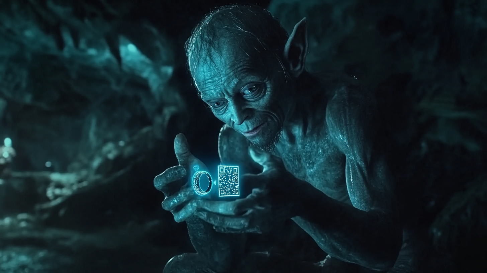

<h2 class="r-fit-text" style="text-align: center"> Digitalización  aplicada a los sectores productivos</h2>

---

<h2 class="r-fit-text" style="text-align: center"> Unidad 1  Una digitalización inesperada</h2>

---

## Digitalización vs Transformación Digital

## ¿Qué es la digitalización?

## ¿Cuándo se convierte en transformación digital?

## Un ejemplo práctico

DHL <!-- .element: class="fragment" -->

Digitalización: Gestión de paquetes y optimización de rutas <!-- .element: class="fragment" -->

Transformación Digital: Robótica en almacenes, drones para reparto y analítica de datos <!-- .element: class="fragment" -->

---

<!-- .slide: data-background-video="assets/chatgpt.mp4" data-background-opacity="0.6" data-background-video-loop data-background-video-muted-->

## ¿Dudas?